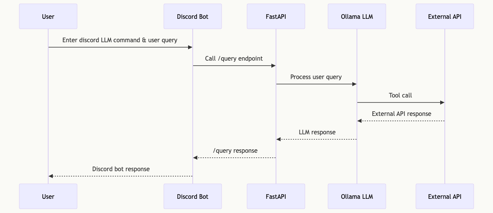

# Discord LLM Agent

This project implements a Discord Bot Agent that leverages a Large Language Model (LLM) to process user queries and interact with external APIs.

## Tech Stack

- Jetson Nano
- FastAPI & Uvicorn
- LangChain
- ollama
- [SCE-discord-bot](https://github.com/SCE-Development/SCE-discord-bot)

## Tasks

1. Download and run ollama model with tool calling support locally
   - [llama3.1](https://ollama.com/library/llama3.1) or [llama3-groq-tool-use](https://ollama.com/library/llama3-groq-tool-use)
   - [Ollama Tool Support](https://ollama.com/blog/tool-support)

2. Define external API endpoints for function/tool calls
   - Specify parameters and expected responses

3. Create FastAPI Server
   - Reference: [FastAPI Tutorial](https://github.com/pnavab/university-of-github/tree/main/FastAPI-Tutorial)
   - Implement endpoints:
     - "/"
     - "/health"
     - "/query"

4. Define Pydantic classes or JSON Schemas for external API tool calling

5. Implement tool calling functions using either:
   - LangChain framework ([LangChain Tool Calling Demo](https://python.langchain.com/docs/how_to/tool_calling/), [LangChain Blog Post](https://blog.langchain.dev/tool-calling-with-langchain/))
   - Ollama ([Ollama Python Example](https://github.com/ollama/ollama-python/blob/main/examples/tools/main.py))

6. Add evaluator for tool calls to prevent API abuse via prompt injection
   - Implement parameter validation, rate limits, authorization validation, and logging

7. Update SCE-discord-bot with LLM command and API call to FastAPI /query endpoint
   - Handle concurrent /query requests from multiple discord users
   - [SCE-discord-bot Repository](https://github.com/SCE-Development/SCE-discord-bot)

## Sequence Diagram

## Future Tasks

- Chat history for discord user queries (context-aware responses)
- Dockerize FastAPI server
- Monitoring (Prometheus, Grafana)